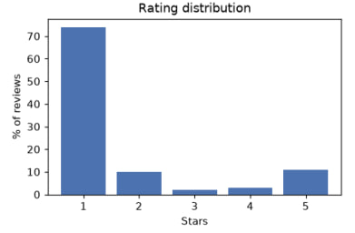
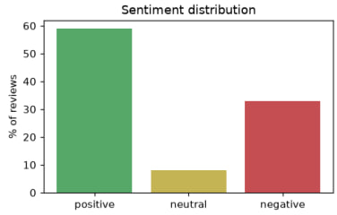
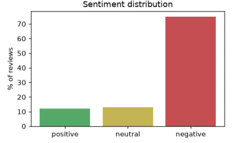
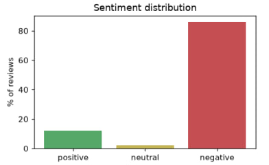

# App Review Analysis Report — Tinder

**App ID:** 547702041 · **Country:** US · **Job ID:** `fd73bc6c-23db-42d4-ad8c-3982ac3e6691`
**Generated:** 2026-09-25 18:30 UTC

## Summary

- **Reviews analyzed:** 100
- **Average rating:** 1.67 / 5

## VADER

**Top negative keywords:** kind, report, moderation, onlyfans, real people,
getting banned, sex, verification, worst, accept

**Insights:**
- Review the most common negative keywords manually for deeper context.

**Execution time:** 0.145s

## Classical (TF-IDF + Logistic Regression)

**Top negative keywords:** time, pay, got, matches, support, likes,
profiles, years, really, appeal

**Insights:**
- Customer support dissatisfaction noted — review response time and
  support quality.

**Execution time:** 0.063s

## BERT

**Top negative keywords:** don, pay, matches, profile, apps, support,
likes, profiles, years, message

**Insights:**
- Customer support dissatisfaction noted — review response time and
  support quality.

**Execution time:** 19.58s

## Observations

- All three methods agree the overwhelming majority of reviews are
  negative, consistent with the 1.67/5 average rating.
- VADER shows a notably higher "positive" share (59%) than Classical (12%)
  or BERT (12%) — a sign that its lexicon-based scoring is less reliable
  on this domain's vocabulary.
- Execution time differs by **three orders of magnitude** between the
  lexicon/classical methods (~0.1s) and BERT (~19.6s on CPU) — an
  important trade-off to note for production latency requirements.
- Negative keywords across methods repeatedly surface "matches", "pay",
  and "support" — suggesting monetization and customer support are
  recurring pain points, independent of which NLP method is used.
